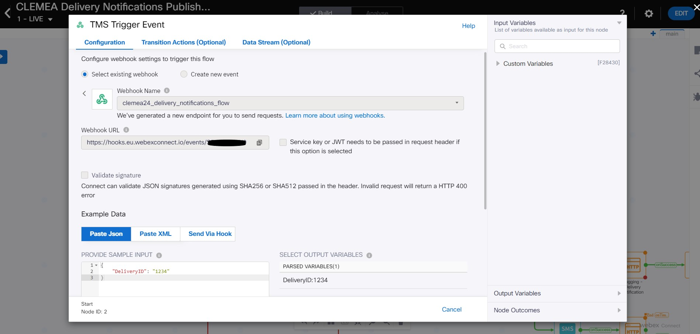
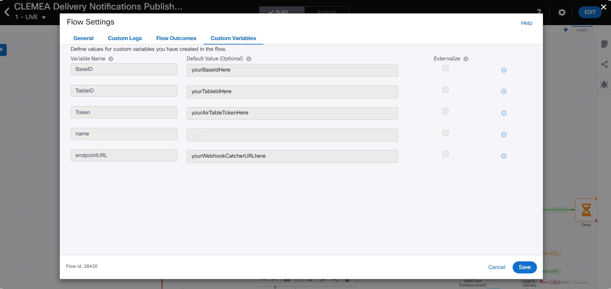
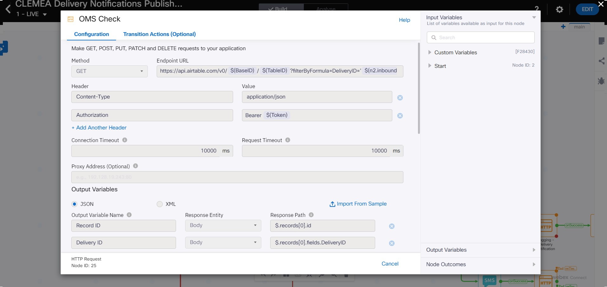
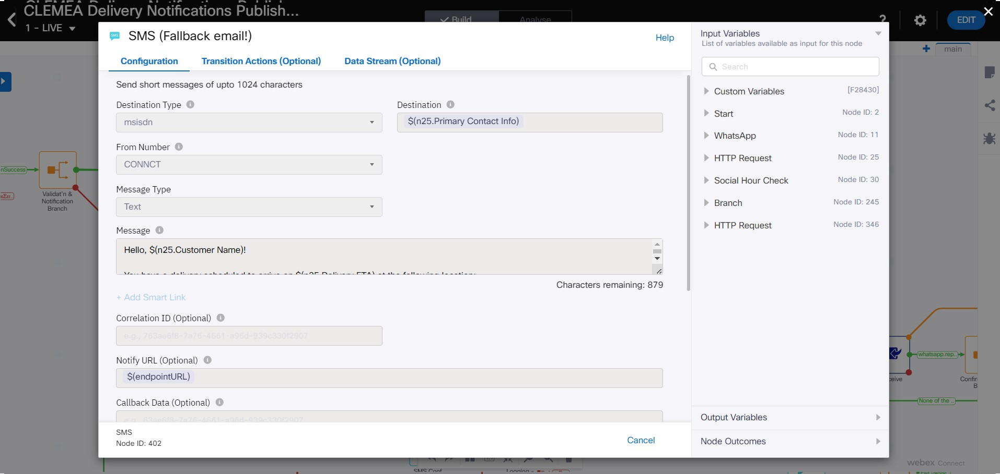
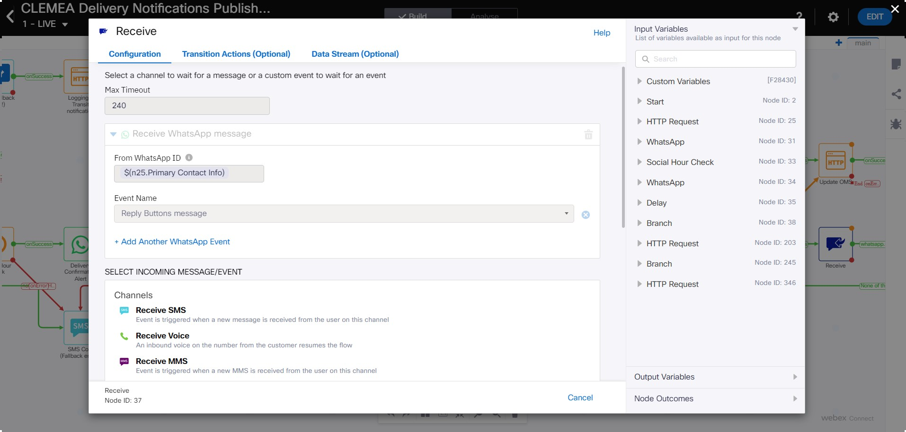

## Pre-requisites

Webex Connect sandbox tenant 
AirTable account 
Postman 
Webhook catcher (webhooksite / requestcatcher / similar)  
Be sure to read step 6 below before first trying to send a WA message to your phone (or any phone).

## Step 1 - Webex Connect sandbox

Visit https://cpaas.webex.com/products/webex-connect/sandbox and follow instructions.

## Step 2 - CLEMEA Reference materials

Visit https://www.ciscolive.com/emea/learn/session-catalog.html and search for gavin or 2956. 
You will need to be signed in to access the resources.

## Step 3 - Configuring AirTable

Use an online API-enabled data repository.  I used AirTable. 
To see the table structure to replicate: https://airtable.com/appf6rR8GCMAfManb/shr95tfdCkn5ZWidd 
Copy the relevant tokens (for AirTable it is Base ID, Table ID and access Token). 
Populate the table as is with order # 1234 WA consent set to True and order # 2345 with consent set to False.

## Step 4 - Starting with the core flow: CLEMEA Delivery Notifications Published

Create a Service 
Create a new flow 
  Chose to upload a flow, name is as CLEMEA Delivery Notifications 
  Drop the file CLEMEA Delivery Notifications Published.workflow into the file upload window

Configure the webhook

  
  
  Select Create a new event 
  Give the new event a name - i.e. clemea_delivery_notifications_event_trigger 
  Copy the webhook URL for configuring Postman later
  
  Define the trigger payload as:
    {
      "DeliveryID": "1234"
    } 
  Parse the payload 
  Save the node 
  
Set the Custom Variables

   
   
  Use your AirTable (or other DB) tokens as per step 3 above.

Update HTTP node "OMS Check"  

  
  
  If you used AirTable as your db, no change is needed to the HTTP Node "OMS CHeck"  
  Else update the http call configuration as required.

Configure the SMS Node 

  
  
  The Sandbox tenant does not have an email asset configured, so to create the channel failover logic I used SMS as the fallback channel. 
  It needs to be cofigured as per step4d.jpg. 
  $(primarycontactinfo) param can be found under the http node output vars.

Configure the Receive nodes 

  
  
  Open and save the receive nodes to confirm the configurations.

## Step 5 - Configuring Postman

Open Postman and import the file CLEMEA24 - Delivery Notifications Published.postman_collection.json 
In the Triggers folder, select the WA and Email triggers and set the webhook URLs to the endpoint URL created in step 4a above. 
The WA trigger will invoke the flow for order # 1234 - resulting in a WA experience. 
The Email trigger will invoke the flow for order # 2345 - resulting in an SMS. 

## Step 6 - Testing your flow

By policy it is nopt possible to send an arbitrary WhatsApp message to a user if they have not engaged with that WhatsApp number within 24 hours. 
Enterprises wishing to send periodic outbound notifications to their customers must use a pre-approved templated message (to protect the channel from abuse). 
This demo does not use such a template (I needed more flexibility in changing my copy etc during the build). 
To run the demo you need to message in to the WhatsApp number set-up on your Sandbox.  Any message will open the conversation window which lasts 24 hours. 
Then your Webex Connect flow can send any message to you. 

More details are available here: https://developers.facebook.com/docs/whatsapp/message-templates/guidelines/

Instructions for the remaining two flows to follow shortly.  The above should get the main flow working.

  
